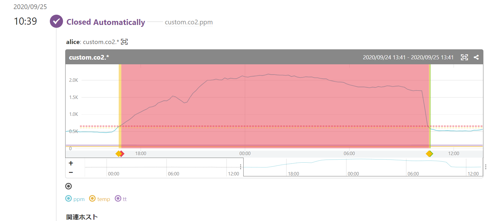

\chapterauthor[nana]{久我山菜々}

# いい雰囲気の自宅にしたい！

## はじめに

こんにちは、KMCのnana(Twitter: \@nonamea774)です。
最近はKMCではガベージコレクションの本の輪読会^[独習KMC vol.15 <https://static.kmc.gr.jp/projects/press/pdf/tykmc15.pdf> ガベコレを作る 参照]
を私の発表で止め続けてるなどの活動をしています^[これを脱稿したら手が開きはじめるのでなんとかします……。]。

ここ最近の趣味はAliExpressでの買い物です。
色々なものを買っては積んで放置したり、触って遊んだりしています。
買った物の中で遊んで良かった回の話をしていきます。

今回紹介するのはコチラ！

* CO~2~センサ MH-Z19B
* 温度湿度センサ AHT10

長年の趣味として、ありとあらゆるものを記録するということを行なっています。
自分の家のこれらのデータは、前者についてはそもそも測定機器が無く、後者も今の値を表示する機械があるだけで記録は全くありませんでした。
これらについても測定/記録したいとは以前から思ってはいたのですが、測定してコンピュータに送信可能な機器は高価であるということがネックとなり実行できていませんでした。
また、「室内の二酸化炭素濃度が上がったら換気するようアラートを上げる」というのはよく話題にも出ていましたが、今まで実現はできていませんでした。
今回安価なセンサーをみつけたので試していきます。

## 測定開始！

### CO~2~センサ MH-Z19B

こちらを先に買ったので、まずCO~2~から測定していきました。
AliExpressで20ドル弱で売っていたのをみつけたので、購入しました。
届いた物を確認したところ、基板が割れていたので紛争
^[バイヤープロテクションの機構。AliExpressの仲裁の下で販売業者とバトルをして勝てば返金を受けることができる。]
をしたら返品不要で全額返金になりました
^[経験上AliExpressでの買い物は1割ぐらいがまず届かず、届いた中の1割程度でまたなんらかの不備があり紛争の可能性があります（話せばわかってくれる業者だと不足している品をまた送ってくれたりするので、紛争が回避されることもあります）。紛争も買い物の体験の内ということです。]。
でも今回の範囲で必要だったところは壊れてなかったので割れたまま使っています。
それはともかく、これは500円玉より一回り大きい程度の大きさのセンサで、UARTで話すことができます。
UARTが何であるかは「シリアル通信の……？」ぐらいの認識でしたが、Raspberry PiのUARTのピンへと接続します。
このセンサの場合、他にも利用している人がいたため、計測するためのPythonのモジュールが既にありました^[というよりも、あることをみつけていたから注文したという方が正確ですが。]。
結線してmh-z19^[<https://pypi.org/project/mh-z19/>]というモジュールを使うと、以下のような出力を得ることができます（単位はppm）。

```code
$ sudo python -m mh_z19
{'co2': 500}
```

これで室内のCO~2~濃度が測れたのであとは保存するだけ……とはいきません。
このセンサがどう較正されてるかが不明だからです。
一応十分換気されている環境下で、「その地点でのCO~2~濃度が400ppmである」とゼロキャリブレーション^[あわせる値が0じゃなくてもこう言う？]することはできますが、正確な値を得ることは難しいです。
ここでは次のような解決策を取ることにしました。
**細かな値は気にしないこととする。**
これが妥当な理由としては、本来の目的は十分に換気ができていない時に注意を促す事なので、濃度が1ppm（あるいは10ppmとかでも？）違うことにそこまで大きな意味は無いからです。
また、最初に十分に換気した時に測定した値の450ppm程度^[正確な値は忘れてしまいました。記録しておくべきでしたね。]という値が、気象庁の出している値
^[<https://ds.data.jma.go.jp/ghg/kanshi/ghgp/co2_trend.html>]からかけ離れておらず、「十分にそれっぽい」からOKということにしました。
一応、別のCO~2~センサであるCCS811も購入しており、それによって測定した値と比較もしてみようかと思っていたのですが、まだ届いた段階のまま積まれています。
もっと雑な評価としては、グラフを後述しますが、部屋を締め切って測定値の変化を観察しました。
「co2 室内 ガイドライン」で検索して出てきた「建築物環境衛生管理基準の設定根拠の検証について」^[<https://www.mhlw.go.jp/seisakunitsuite/bunya/kenkou_iryou/kenkou/seikatsu-eisei/gijutukensyuukai/dl/h23_3.pdf>]によるとCO~2~の基準値として許容限界が5000ppm、推奨値が1500ppm、目標値が1000ppmとされています
^[これは`Ref. 小林陽太郎, 他(1966) ビルディングの環境衛生基準に関する研究. 昭和40年度厚生科学研究報告書.`とあるので孫引きだけどそれっぽい基準みたいです。家の中で目安にするならこれぐらいでも……。]。
これらの値について測定された値と比較すると、「これぐらいの時間で換気したほうがいいな」と思えるような時間でそれぐらいの値が出ていました。
目的は果せそうなので、一旦これにてOKということにします。

### 温度湿度センサ AHT10

UARTではなくI^2^Cで話すというだけで、CO~2~の時とほとんど同じです。
こっちのほうは1ドル程度で売っていたセンサです。
サイズは親指の爪ぐらい。
取得するコードもRaspberry Piののフォーラムにあったのを出力だけ整形しただけのものを動かしています^[<https://www.raspberrypi.org/forums/viewtopic.php?t=265734#p1615428> temperatureを扱うコードの上でtemporaryをtmpって略さないでほしい。動いてるのは偉いですが……。]。

これについても較正の問題がありますが、タニタの温度湿度計TT-580を横に置いて値の変化を見たらそれっぽいのでヨシとしました。

こちらの値は年間の変動とかを長期的には見てみるとおもしろいかもしれないと思っています^[CO~2~は家にいるかどうかの影響が大きく、長期的な変動についてあまり意味が無さそうであるのと対照的に。]。

## Mackerelに送る。

測定しているだけだと当初の目的である換気を促すことができないので、変化について知るためにMackerelへと測定した値を送信します。
これは単にMackerelのAPIを叩くだけです^[<https://mackerel.io/ja/api-docs/entry/host-metrics#post>]。
これで時間変化のグラフを眺めることもできます。
以下が執筆中のグラフですが、9時ぐらいに目覚めてから窓を開けていて、夕方に寒くなってきたので閉めた様子が見えます。


グラフを眺めるだけでなく、アラートを仕込むことができます。
アラートを送る閾値の決定は難しい問題です。
前述の基準値1000/1500ppmを一旦それぞれwarning/criticalの閾値としたところ、発報される頻度もうるさくなく、閉め切ってからしばらくしたらwarningが出る程度です。
動かしはじめてから3ヶ月弱になりますが、ある程度丁度いい閾値であるとは思っています。
温度/湿度の基準値については模索中です。

閉め切った時の値の上昇と、換気による一気に下降の図。
Alertが発生して換気を始めて解消されています。



## DynamoDBにも送る。

Mackerelは便利なのですが無料枠の範囲だとデータが1日しか保存されません^[これは無料で使っているのが本質的には悪いです。お金を払え。ただ、学生がお家の中で使うにはちょっと高すぎるので許して……。]。
元々の目的としてはMackerlに送信する段階で達成しているのですが、全てを保存することは趣味の一つであるので、せっかく測定したデータを捨てていきたくありません。
どこかに保存したいので、現在は一時的な保存先としてDynamoDBを用いています。

テーブル設計は以下のようにしていますが、これで良いのかどうか正直自信は無いです。
有識者がいたら助けて……。

* プライマリパーティションキー: type（文字列） CO2の時は文字列co2、AHT10で測定したデータではtemperature
* プライマリソートキー	time（数値）測定した時点のunix time

DynamoDBにRaspberry Piから送信するためにlambda/api gatewayの1枚のアプリを利用しています^[ソースコードは<https://github.com/nna774/momochi>にあります。認証は未実装なので誰でも嘘の値を投げられる手抜きですが、まぁそんなことされないので……しないでね。]。
このlambdaの中で受けとったデータをMackerelにもproxyして送ってるので、最新一日のグラフとアラートが見れるようになって便利です。

## 今後の展望

DynamoDBに単に積んでいるデータを日次でS3に置いたりして、もっと楽に扱えるようにしていきたいです^[今のテーブル設計だとやればできるはずだと信じてる……。]。
それを利用して長期のグラフを描いたりして変動を眺めたりしていきたい。
リアルタイムで描けるともっとおもしろいかも？

また、Waveshareのe-PaperをAliExpressで買ってあるので、そこに現在の様子を出してぱっと見れるようにしたら便利かもと思い、思い出した時に実装しています^[<https://github.com/nna774/nanami-dashboard> ダッシュボードとして表示するところはだいたいできたけど、e-paperに出すところはまだ全然書いてない（叩くべきAPIとかは確認して技術的にはできそうな感じのところまではきてるからやるだけです。やっていきましょう）。]。

## さいごに

実はこれは
<https://scrapbox.io/rebuild-kitashirakawa/MH-Z19Bで自宅のCO2濃度を測定する。>
と
<https://scrapbox.io/rebuild-kitashirakawa/AHT10>
にて既に軽くは書いていたので、細かなコード等はそちらもぜひ参照ください。

届かなかったり壊れていたりしていることがあってもAliExpressでの買い物は楽しいので、これからもおもしろそうなセンサをみつけたら買って試していきたいと思います。
みなさんもぜひお家にあるRaspberry Piにおもしろそうなセンサをつけて色々な値を測定してみてください。
いいセンサを発見したらぜひ私にも教えてください！
