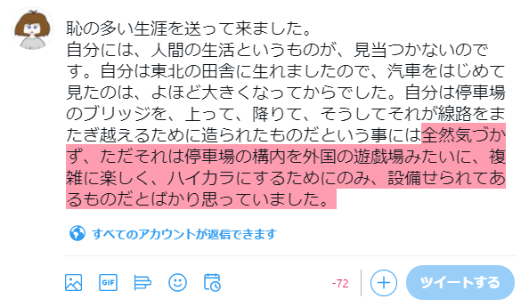
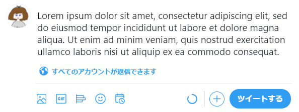
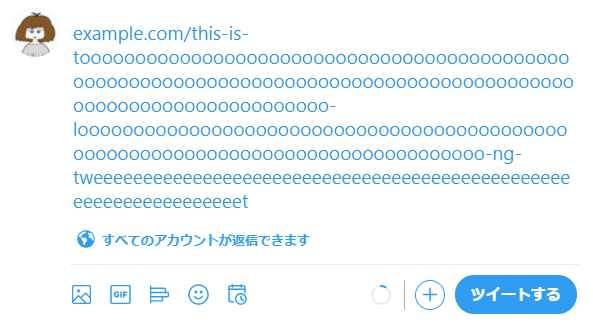

\chapterauthor[utgwkk]{うたがわきき}

<!-- 単なるスペースだと改行に変換されてしまうので \ にした -->
# 詳説\ ツイートの文字数を数える方法

## はじめに

こんにちは、KMC 6回生のうたがわききです。
最近はPerlを書いて暮らしています。

みなさまはTwitterをやっていますか？ やっていない方にとっては、この記事の内容はピンと来ないかもしれません。

この記事では、Twitterにおけるツイートの文字数の数え方について、および文字数を数えるライブラリの実装について説明します。
正規表現についての知識があったほうがスムーズに読めるかもしれません。
また、Perlのコードが出てきますが、何らかのプログラミング言語に馴染みがあれば雰囲気がつかめるように解説していくつもりです。
とはいえどうしても、ある程度Perlが読めるほうが楽しめると思います。
予めご了承ください。

## ツイートの文字数を数えることの難しさ

ツイートの文字数の数え方は、公式のドキュメントで解説されています[^twitter-counting-characters]。
このセクションでは、公式のドキュメントを噛み砕いてツイートの文字数の数え方を説明します。
一筋縄ではいかない、ということも理解してもらえるのではないかと思います。

2020/12/6 時点で、ツイートの長さは最大で280文字です。
ただし、文字種によって1文字とカウントするか2文字とカウントするかが変わります。
そのため、単にプログラミング言語に組み込みの方法で文字数を数えるだけでは、ツイートの文字数制限を超過しているかどうかを判定することができません。

以下では、特に断りなく「1文字」「2文字」のように書いたときは、ツイートの長さの単位としての文字数のことだとします。
また、「日本語で1文字」「アルファベットで1文字」のように言語名や文字種を明示したときは、ツイートの長さの単位ではなく、その文字種における文字数のことであるとします。

[^twitter-counting-characters]: <https://developer.twitter.com/en/docs/counting-characters>

図\ref{utgwkk:image:invalid-tweet-ja}は、日本語で213文字のツイートを投稿しようとしたが文字数制限を超過している様子です。
ひらがな・カタカナ・漢字などは2文字としてカウントされるので、280文字の制限を超えてしまいます。

{ width=12cm }

アルファベットで231文字のツイートを投稿しようとしている様子を図\ref{utgwkk:image:valid-tweet-lorem-ipsum}に示します。
アルファベットは1文字としてカウントされるので、日本語で213文字のツイートとは異なり文字数制限を超過していません。

{ width=12cm }

ただし、URLは例外です。
validなURLであれば、長さに関係なく23文字としてカウントされます。
したがって、図\ref{utgwkk:image:valid-tweet-long-url}のように長大なURLであっても、URLとしてvalidでさえあればツイートに含めることができます。

{ width=12cm }

絵文字は全て「目に見える絵文字」1文字が2文字とカウントされます。
図\ref{utgwkk:image:emoji-family-man-woman-girl-boy}は、父・母・息子・娘による家族の絵文字 (Twemoji[^twemoji]) です。

[^twemoji]: <https://twemoji.twitter.com/>

{ width=1.5cm }

この絵文字は、以下の文字によって構成されており、そして2文字としてカウントされます（括弧内はUnicodeのコードポイント）。

- { height=10pt } 男性 (`U+1F468`)
- ゼロ幅接合子 (`U+200D`)
- { height=10pt } 女性 (`U+1F469`)
- ゼロ幅接合子 (`U+200D`)
- { height=10pt } 女の子 (`U+1F467`)
- ゼロ幅接合子 (`U+200D`)
- { height=10pt } 男の子 (`U+1F466`)

これらの「文字」によって構成された「目に見える絵文字」1文字が2文字としてカウントされます。ゼロ幅接合子がなければ、それぞれの家族が独立した「目に見える絵文字」になるので、$2 \times 4 = 8$文字とカウントされます。

また、プログラミング言語によって絵文字が何文字としてカウントされるかが異なります。
例えばJavaScriptでは\ `"`{ height=10pt }`".length` という式は1ではなく2を返します[^why-sushi-length-is-2]。<!-- "🍣".length の直前が詰まりすぎてるように感じるのでスペースを入れる -->

[^why-sushi-length-is-2]: この理由については MDN などを読むか、お近くの JavaScript の達人に聞いてみてください。 <https://developer.mozilla.org/ja/docs/Web/JavaScript/Reference/Global_Objects/String/length>

このように、ツイートの文字数を正しく数えるのは非常に難しいということが分かります。

- 文字種によって文字数のカウントが変わる
  - 言語組み込みの方法だけでは正しくカウントできない
- URLを特別扱いする必要がある
  - どこまでがURLなのかを正しく判定する必要がある
- 絵文字を特別扱いする必要がある
  - 言語組み込みの方法だけでは正しくカウントできないことがある
  - どこまでが「目に見える絵文字」なのかを正しく判定する必要がある

## ツイートの文字数計算のためのライブラリ

前節ではツイートの文字数計算の難しさについて、例を交えて説明しました。
Twitter公式のシェアボタンなどを使うにあたってはこのような事情を考える必要はありませんが、たとえばユーザーが任意に設定した文言を時間指定でツイートするサービスなどを運用するにあたっては考慮しなければなりません。
文字数制限を超過したツイートを入力できないようにするか、あるいは超過した文字数ぶんの文字を削ってツイートできるようにする必要があります。

幸いにも、Twitter公式がツイートの文字数を数えるためのライブラリ twitter-text[^twitter-text] を提供しています。
これを使わない手はないでしょう。

[^twitter-text]: <https://github.com/twitter/twitter-text>

twitter-text は、以下の言語で実装されています。

- Java
- JavaScript
- Objective-C
- Ruby

JavaはAndroidアプリやWebアプリケーション（JVM実装）などのために必要でしょう。
Objective-CもiOSアプリのためであると推測できます。
JavaScriptはフロントエンド向けでしょう。

Ruby実装があるのが興味深いです。
Twitterは、かつてRuby on Railsで開発されていましたが、2008年にJava (JVM) への移行を始めています[^twitter-ruby-to-jvm]。
twitter-textのfirst commitが2010/1/16で、その時点で全コードがJVM移行されていなかったため、Rubyでのtwitter-text実装が必要だったのでしょう。

[^twitter-ruby-to-jvm]: Twitterが、Ruby on RailsからJavaVMへ移行する理由 － Publickey <https://www.publickey1.jp/blog/11/twitterruby_on_railsjavavm.html>

また、サードパーティ製のtwitter-text互換ライブラリが以下の言語で実装されています。

- Swift[^twitter-text-swift]
- Rust[^twitter-text-rust]
- Perl[^twitter-text-perl]

Rust製のライブラリは、なんとC++やPythonなどの言語向けにも使うことができるようです。
ヤバいですね！

[^twitter-text-swift]: <https://swiftpack.co/package/nysander/twitter-text>
[^twitter-text-rust]: <https://crates.io/crates/twitter-text>
[^twitter-text-perl]: <https://metacpan.org/pod/Twitter::Text>

## Twitter::Text (Perl実装) について

さて、先日、先述したPerl向けのtwitter-textライブラリ Twitter::Text を実装・公開しました。
ここからようやく本題に入ります。
以下のように、`parse_tweet` という関数を呼び出すことで、与えられた文字列がツイートとしてvalidかどうか、などを解析した結果のハッシュリファレンス[^hashref]を返します。

[^hashref]: ここではPythonでいう辞書 (dict) やRubyでいうHashのようなものだと思ってください。

```perl
use Data::Dumper;
use Twitter::Text;
 
$result = parse_tweet('Hello world こんにちは世界');
print Dumper($result);
# $VAR1 = {
#       'weighted_length' => 33
#       'permillage' => 117,
#       'valid' => 1,
#       'display_range_start' => 0,
#       'display_range_end' => 32,
#       'valid_range_start' => 0,
#       'valid_range_end' => 32,
#     };
```

ハッシュリファレンスは、以下のキーで解析結果の値を持っています。

- `weighted_length`
  - ツイートの文字数を表します。
- `permillage`
  - ツイートの文字数上限に対する千分率です。
- `valid`
  - ツイートがvalidかどうかを表す真偽値です。文字数制限のほかに、BOM[^bom]などツイートに含められない文字が含まれているかどうかによって値が変わります。
- `display_range_start`
  - 表示される文字列範囲の始点を表します。常に0を返します。
- `display_range_end`
  - 表示される文字列範囲の終点を表します。
- `valid_range_start`
  - ツイートとしてvalidな文字列範囲の始点を表します。常に0を返します。
- `valid_range_end`
  - ツイートとしてvalidな文字列範囲の終点を表します。`display_range_end` からこの値を引くと、ツイートをvalidにするために何文字削ればよいかが計算できます。

[^bom]: byte order mark

## 実装方針

「ツイートの文字数を数えることの難しさ」のセクションでも説明したように、ツイートの文字数を正しく計算するには、以下の課題をクリアする必要があります。

- 文字種によって文字数のカウントが変わる
- URLを特別扱いする必要がある
- 絵文字を特別扱いする必要がある

逆に言えば、1つずつ解決していけばツイートの文字数を計算できるということです。
つまり、地道にやっていくことになります。

### URLを抽出する

validなURLは23文字としてカウントされるので、URLがツイートのどこにあるかを特定しなければなりません。
URLを抽出する関数 `extract_urls_with_indices` の実装を見ていきます。

まず、validなURLにマッチする箇所を抽出していきます。
以下のように、正規表現マッチに対して `while` ループを行うことで、validなURLの正規表現にマッチする箇所を抽出してループを回すことができます。

```perl
while ($text =~ /($Twitter::Text::Regexp::valid_url)/g) {
    my $before   = $3;
    my $url      = $4;
    my $protocol = $5;
    my $domain   = $6;
    my $path     = $8;
    my ($start, $end) = ($-[4], $+[4]);
```

ここで `$Twitter::Text::Regexp::valid_url` は以下のように定義されます。
この正規表現全体を `()` で囲んで、それぞれの括弧で囲まれたグループにマッチした文字列を `$3` といった特殊変数で参照しています[^group-num]。
また、`$-[4]`, `$+[4]` でURLにマッチした箇所の開始・終了位置を取得できます。
`$Twitter::Text::Regexp::valid_url` を更に括弧で囲んでいるので、以下のコメントにある特殊変数の番号が1つずつ増えています。

[^group-num]: グループの番号は、開き括弧 `(` が最も先頭にあるものから順に 1, 2,...... と付けられます。

```perl
our $valid_url = qr{
  (                                    # $1 正規表現全体
    ($valid_url_preceding_chars)       # $2 URLの直前の文字列
    (                                  # $3 URL
      (https?:\/\/)?                   # $4 プロトコル (optional)
      ($valid_domain)                  # $5 ドメイン
      (?::($valid_port_number))?       # $6 ポート番号 (optional)
      (/$valid_url_path*)?             # $7 パス
      (\?                              # $8 クエリ文字列
        $valid_url_query_chars*
        $valid_url_query_ending_chars
      )?
    )
  )}ix;
```

上記の正規表現で抽出したURLに対して、プロトコルを含むかどうかで条件分岐します。

まずはプロトコルがない場合の処理です。
この場合は、ドメイン名がASCII文字列のみで構成されるURLをvalidなものとして抽出していきます。

次に、プロトコルがある場合です。
このとき、`t.co` [^t-co]のURLである場合は、さらにパス部分の長さが一定以下であるものだけをvalidだとして抽出します。
`t.co` のURLでなければ、ドメインがvalidかどうかを見て抽出します。

[^t-co]: Twitterの短縮URLサービス。

以上の規則でURLを抽出して、以下のような構造のハッシュリファレンスの配列リファレンス[^arrayref]として返します。

- `url`
  - 抽出したURLを表す文字列です。
- `indices`
  - URLが出現する位置を表す、`[始点, 終点]` という配列リファレンスです。

[^arrayref]: Pythonのリスト型やRubyのArrayだと思ってください。

### 絵文字を抽出する

次に、絵文字の位置を抽出する必要があります。
これはURLほど複雑ではなく、単に絵文字の正規表現にマッチする文字列の範囲を `extract_urls_with_indices` と同様に抽出すればよいです。
ただし「絵文字にマッチする正規表現」を正確に記述する必要があります。
これについては後のセクションで触れます。

### 1文字ずつ読んで重みを計算する

あとは、URLと絵文字以外の箇所を1文字ずつ読んで、重みを踏まえつつ文字数を計算するだけです。
ただし、ツイートに含められない文字というものがあるので、それが出現したらただちにツイートとしてinvalidであると判定する必要があります。

文字種ごとの重みのデータが、公式ライブラリに JSON 形式で同梱されています[^config-json]。
これを元に文字数を計算していけばよいです。

[^config-json]: <https://github.com/twitter/twitter-text/blob/33169dfd33d61debdbf58dc940f5a200c06def10/config/v3.json>

## おもしろポイント

Twitter::Text を実装していて、おもしろいな、と思ったポイントを挙げていきます。

### 正規表現地獄

Twitter::Text は、公式のtwitter-textのRuby実装をもとに移植するかたちで実装しました。
その中で、まずはRubyの正規表現をPerlの正規表現に移植するところから始めたのですが、最初は途方に暮れました。
おそらく部誌に正規表現を載せると何ページも埋まってしまうので載せられませんが、興味のある方は絵文字にマッチする正規表現[^regex-emoji]などを見てみてください。
validなURLにマッチする正規表現も、物量こそ絵文字のそれには劣りますが、なかなか圧巻でした。

[^regex-emoji]: <https://metacpan.org/source/UTGWKK/Twitter-Text-0.07/lib/Twitter/Text/Regexp/Emoji.pm>

ISUCON10本戦だったと思うのですが、誰かが「SQLで書いてあると移植が容易[^sql-youi]」という発言をしていたのを思い出しました。
正規表現についても同様のことが言えるのではないでしょうか。

[^sql-youi]: 可読性があるとは言ってない。

### さまざまな特殊変数

正規表現マッチで文字列をパースしていくにあたって、Perlの特殊変数から逃れることはできません。
いくつかの特殊変数について紹介します。

`$1`, `$2`,...... という変数で、正規表現マッチした中のグループの1番目、2番目、……の文字列を抽出できます。
たとえば `'dog cat' =~ /([a-z]+)\s+([a-z]+)/` という式を評価した直後は `$1 = 'dog'`,`$2 = 'cat'` になります。

`@-`, `@+` という変数で、正規表現マッチしたグループのそれぞれ開始・終了位置を取得できます。
`'dog cat' =~ /([a-z]+)\s+([a-z]+)/` の例では以下のようになります。

- `$-[1] = 0`
- `$+[1] = 2`
- `$-[2] = 4`
- `$+[2] = 6`

この他にも、Perlにはさまざまな特殊変数があります。
興味がある方はperldoc perlvar[^perldoc-perlvar]を読んでみてください。

[^perldoc-perlvar]: <https://perldoc.perl.org/perlvar>

### YAMLのパーサー

公式のtwitter-textには、TLD一覧やテストケースがYAML形式で同梱されています[^conformance]。
したがって、正常に動作させるには、また正常に動作することを確かめるにはYAMLをパースする必要があります。

[^conformance]: <https://github.com/twitter/twitter-text/tree/33169dfd33d61debdbf58dc940f5a200c06def10/conformance>

Perl向けのYAMLをパースするライブラリとして、以下が挙げられますが、それぞれパースできるYAMLの構文が異なります。

- YAML[^cpan-yaml]
- YAML::PP[^cpan-yaml-pp]
- YAML::Tiny[^cpan-yaml-tiny]

[^cpan-yaml]: <https://metacpan.org/pod/YAML>
[^cpan-yaml-pp]: <https://metacpan.org/pod/YAML::PP>
[^cpan-yaml-tiny]: <https://metacpan.org/pod/YAML::Tiny>

とくにYAML::Tinyは、実装が軽いのですが、うまくパースできないYAMLの構文があります。
当初はYAML::Tinyを採用していたのですが、 `\uXXXX` のようなUnicodeの文字を表すリテラルがパースできませんでした。
そのため、文字列を正規表現で置換して `eval` することでコードポイントから文字列に変換していました。
今はYAML::PPを採用しているので、そのような処理は行っていません。

### 圧巻のテストケース

テストケースのYAML[^validate-yml]は一見の価値があります。
実際にツイート欄に貼り付けて、本当にツイートできるかどうか確かめてみるのもよいでしょう。

[^validate-yml]: <https://github.com/twitter/twitter-text/blob/33169dfd33d61debdbf58dc940f5a200c06def10/conformance/validate.yml>

### ドメイン名の長さ制限

ブログにも書きました[^twitter-test-debug]が、ドメイン名を `.` で区切ったときの各文字列は63文字以内でないといけません。
これはRFC 1034[^rfc-1034]を読むと書いてあります。
普段こういうことを意識せず暮らしていたので、あるバージョンのPerlでTwitter::Textのテストが落ちるように見えていて、原因を特定するのに苦労していました。
こういうことから知恵が1つ増えるのは生きる喜びという感じがしますね。

[^twitter-test-debug]: <https://blog.utgw.net/entry/2020/11/21/183736>
[^rfc-1034]: <https://tools.ietf.org/html/rfc1034>

## おわりに

Twitterのツイートの文字数を数える方法、および文字数を数えるライブラリのTwitter::Textの実装方針について紹介してきました。
ツイートのバリデーションが難しいということが分かっていただければ本望です。

なにか意見などありましたらTwitterで \@utgwkk までメンションなどよろしくお願いします。
また、IssueやPull Requestも歓迎です。
GitHubリポジトリ[^github-repo]までよろしくお願いします。

[^github-repo]: <https://github.com/utgwkk/Twitter-Text>
