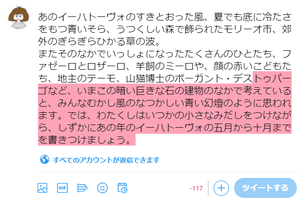

\chapterauthor[utgwkk]{うたがわきき}

<!-- 単なるスペースだと改行に変換されてしまうので \ にした -->
# 詳説\ ツイートの文字数を数える方法

## はじめに

こんにちは、KMC 6回生のうたがわききです。
みなさまはTwitterをやっていますか？ やっていない方にとっては、この記事の内容はピンと来ないかもしれません。

この記事では、Twitterにおけるツイートの文字数の数え方について、および文字数を数えるライブラリの実装について説明します。
正規表現についての知識があったほうがスムーズに読めるかもしれません。
また、Perlのコードが出てきますが、こちらはPerlを知らなくても何らかのプログラミング言語に馴染みがあれば雰囲気がつかめるように解説していくつもりです。

## ツイートの文字数を数えることの難しさ

ツイートの文字数の数え方は、公式のドキュメントで解説されています[^twitter-counting-characters]。
2020/12/6 時点で、ツイートの長さは最大で280文字です。
ただし、文字種によって1文字とカウントするか2文字とカウントするかが変わります。
そのため、単にプログラミング言語に組み込みの方法で文字数を数えるだけでは、ツイートの文字数制限を超過しているかどうかを判定することができません。

以下では、特に断りなく「1文字」「2文字」のように書いたときは、ツイートの長さの単位としての文字数のことだとします。
また、「日本語で1文字」「アルファベットで1文字」のように言語名や文字種を明示したときは、ツイートの長さの単位ではなく、その文字種における文字数のことであるとします。

[^twitter-counting-characters]: \url{https://developer.twitter.com/en/docs/counting-characters}

図\ref{utgwkk:image:invalid-tweet-ihatov}は、日本語で258文字のツイートを投稿しようとしたが文字数制限を超過している様子です。
ひらがな・カタカナ・漢字などは2文字としてカウントされるので、280文字の制限を超えてしまいます。

{ width=12cm }

アルファベットで231文字のツイートを投稿しようとしている様子を図\ref{utgwkk:image:valid-tweet-lorem-ipsum}に示します。
アルファベットは1文字としてカウントされるので、日本語で258文字のツイートとは異なり文字数制限を超過していません。

{ width=12cm }

ただし、URLは例外です。
validなURLであれば、長さに関係なく23文字としてカウントされます。
したがって、図\ref{utgwkk:image:valid-tweet-long-url}のように長大なURLであっても、URLとしてvalidでさえあればツイートに含めることができます。

{ width=12cm }

絵文字は全て「目に見える絵文字」1文字が2文字とカウントされます。
図\ref{utgwkk:image:emoji-family-man-woman-girl-boy}は、父・母・息子・娘による家族の絵文字です。

{ width=2cm }

この絵文字は、以下の文字によって構成されており、そして1文字としてカウントされます（括弧内はUnicodeのコードポイント）。

- 男性 (`U+1F468`)
- ゼロ幅接合子 (`U+200D`)
- 女性 (`U+1F469`)
- ゼロ幅接合子( `U+200D`)
- 女の子 (`U+1F467`)
- ゼロ幅接合子( `U+200D`)
- 男の子 (`U+1F466`)

これらの「文字」によって構成された「目に見える絵文字」が1文字としてカウントされます。ゼロ幅接合子がなければ、それぞれの家族が独立した「目に見える絵文字」になるので、4文字とカウントされます。

また、プログラミング言語によって絵文字が何文字としてカウントされるかが異なります。
例えばJavaScriptでは `"(寿司の絵文字)".length` という式は1ではなく2を返します[^why-sushi-length-is-2]。

[^why-sushi-length-is-2]: この理由については MDN などを読むか、お近くの JavaScript の達人に聞いてみてください。 \url{https://developer.mozilla.org/ja/docs/Web/JavaScript/Reference/Global_Objects/String/length}

このように、ツイートの文字数を正しく数えるのは非常に難しいということが分かります。

- 文字種によって文字数のカウントが変わる
  - 言語組み込みの方法だけでは正しくカウントできない
- URLを特別扱いする必要がある
  - どこまでがURLなのかを正しく判定する必要がある
- 絵文字を特別扱いする必要がある
  - 言語組み込みの方法だけでは正しくカウントできないことがある
  - どこまでが「目に見える絵文字」なのかを正しく判定する必要がある

## ツイートの文字数計算のためのライブラリ

前節ではツイートの文字数計算の難しさについて、例を交えて説明しました。
Twitter公式のシェアボタンなどを使うにあたってはこのような事情を考える必要はありませんが、たとえばユーザーが任意に設定した文言を時間指定でツイートするサービスなどを運用するにあたっては考慮しなければなりません。
文字数制限を超過したツイートを入力できないようにするか、あるいは超過した文字数ぶんの文字を削ってツイートできるようにする必要があります。

幸いにも、Twitter公式がツイートの文字数を数えるためのライブラリ twitter-text を提供しています。
これを使わない手はないでしょう。

twitter-text は、以下の言語で実装されています。

- Java
- JavaScript
- Objective-C
- Ruby

JavaはAndroidアプリやWebアプリケーション（JVM実装）などのために必要でしょう。
Objective-CもiOSアプリのためであると推測できます。
JavaScriptはフロントエンド向けでしょう。

Ruby実装があるのが興味深いです。
Twitterは、かつてRuby on Railsで開発されていましたが、2008年にJava (JVM) への移行を始めています[^twitter-ruby-to-jvm]。
twitter-textのfirst commitが2010/1/16で、その時点で全コードがJVM移行されていなかったため、Rubyでのtwitter-text実装が必要だったのでしょう。

[^twitter-ruby-to-jvm]: Twitterが、Ruby on RailsからJavaVMへ移行する理由 － Publickey \url{https://www.publickey1.jp/blog/11/twitterruby_on_railsjavavm.html}

また、サードパーティ製のtwitter-text互換ライブラリが以下の言語で実装されています。

- Swift[^twitter-text-swift]
- Rust[^twitter-text-rust]
- Perl[^twitter-text-perl]

Rust製のライブラリは、なんとC++やPythonなどの言語向けにも使うことができるようです。

[^twitter-text-swift]: \url{https://swiftpack.co/package/nysander/twitter-text}
[^twitter-text-rust]: \url{https://crates.io/crates/twitter-text}
[^twitter-text-perl]: \url{https://metacpan.org/pod/Twitter::Text}

## Twitter::Text (Perl実装) について

さて、先日、先述したPerl向けのtwitter-textライブラリ Twitter::Text を実装・公開しました。
以下のように、`parse_tweet` という関数を呼び出すことで、与えられた文字列がツイートとしてvalidかどうか、などを解析した結果のハッシュリファレンス[^hashref]を返します。

[^hashref]: ここではPythonでいう辞書 (dict) やRubyでいうHashのようなものだと思ってください。

```perl
use Data::Dumper;
use Twitter::Text;
 
$result = parse_tweet('Hello world こんにちは世界');
print Dumper($result);
# $VAR1 = {
#       'weighted_length' => 33
#       'permillage' => 117,
#       'valid' => 1,
#       'display_range_start' => 0,
#       'display_range_end' => 32,
#       'valid_range_start' => 0,
#       'valid_range_end' => 32,
#     };
```

ハッシュリファレンスは、以下のキーで解析結果の値を持っています。

- `weighted_length`
  - ツイートの文字数を表します。
- `permillage`
  - ツイートの文字数上限に対する千分率です。
- `valid`
  - ツイートがvalidかどうかを表す真偽値です。文字数制限のほかに、ツイートに含めれない文字が含まれているかどうかによって値が変わります。
- `display_range_start`
  - 表示される文字列範囲の始点を表します。常に0を返します。
- `display_range_end`
  - 表示される文字列範囲の終点を表します。
- `valid_range_start`
  - ツイートとしてvalidな文字列範囲の始点を表します。常に0を返します。
- `valid_range_end`
  - ツイートとしてvalidな文字列範囲の終点を表します。`display_range_end` からこの値を引くと、ツイートをvalidにするために何文字削ればよいかが計算できます。

## 実装方針
 
### 正規表現地獄

TODO: 書きましょう

### YAMLのパーサー

TODO: 書きましょう

## おわりに

いかがでしたか？
